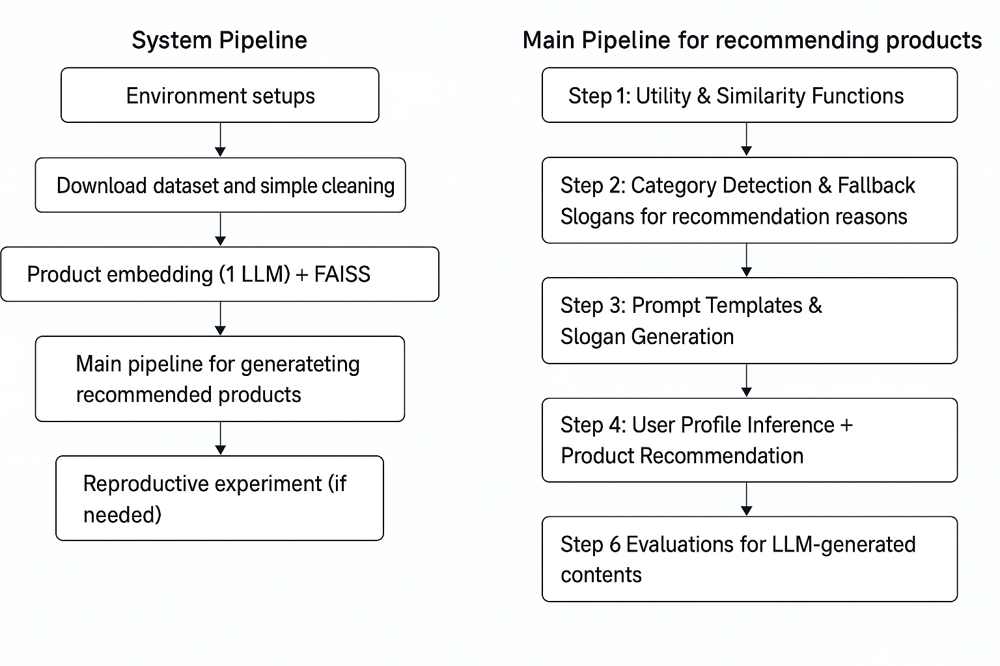
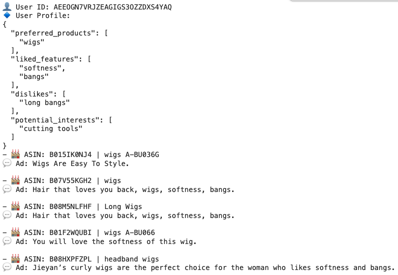

# 🧠 Jia Jia – GenAI/ML Project Portfolio

Welcome! This is a collection of my recent projects in Generative AI, built during my MSc Data Science at LSE and reflecting my transition into AI product development. My focus has been on LLM-based recommendation systems, retrieval-augmented generation (RAG), and prompt engineering with open-source tools.


## 📚 Table of Contents

### 🧠 GenAI Project Portfolio
  - 📌 [LLM-Based Product Recommender](#-1-llm-based-product-recommender)
  - 📌 [Twitch Topic Extraction & Sentiment Analysis](#-2-twitch-topic-extraction--sentiment-analysis)
  - 📌 [AI-Powered Travel Planner - Vibego](#-3-ai-powered-travel-planner---vibego)
### ⚙️ Machine Learning & Deep Learning Projects
  - 📌 [Legacy Donation Analysis](#-4-Legacy-Donation-Analysis)
  - 📌 [Speech Emotion Detection](#-5-Speech-Emotion-Detection)
  - 📌 [HMT UK GDP](#-6-HMT-UK-GDP-Prediction)
  - 📌 [Brain Tumor Classification](#-7-Brain-Tumor-Classification)

### 🧑‍🎨 Creative Tech
  - 🎧 [Live Coding with Strudel](#-live-coding-with-strudel-exploring-code-based-music-interaction)

---

## 📌 1. [LLM-Based Product Recommender](https://github.com/zench2302/llm-recommender)

### Description: 

Developed an end-to-end recommendation system powered by LLMs for Amazon product reviews. The system embeds product metadata and review content using Flan-T5 and MiniLM, then computes similarity via Faiss for Top-5 recommendations.

### Key Technologies:  
- Nous-Hermes-2 (Mistral) for generating user profiles from review history
- Flan-T5 for generating ad-style recommendation reasons  
- BGE (BAAI) and MiniLM embeddings for product and user vectorization  
- FAISS for approximate nearest neighbor (ANN) vector search and candidate retrieval  
- Prompt engineering for review summarization and recommendation reasoning

### System and Recommendation Pipeline



### Prompts Engineering
**(1) User Profiling Prompt (Mistral)**
```text
You are a professional shopping assistant.

Analyze the following user reviews and summarize their preferences.

Reviews:
""" <user reviews> """

Return JSON with:
- "preferred_products"
- "liked_features"
- "dislikes"
- "potential_interests"
```
<details>
<summary>🔧 Full Python Implementation (click to expand)</summary>
  
```python
def generate_user_profile(user_reviews):
    prompt = f"""
You are a professional shopping assistant.

Analyze the following user reviews and summarize their preferences.

Reviews:
\"\"\"{user_reviews[:Config.MAX_REVIEW_LENGTH]}\"\"\"

Return JSON with:
- "preferred_products"
- "liked_features"
- "dislikes"
- "potential_interests"
"""
    inputs = profile_tokenizer(prompt, return_tensors="pt", truncation=True, max_length=1024).to(profile_model.device)
    outputs = profile_model.generate(
        **inputs,
        max_new_tokens=Config.MAX_NEW_TOKENS,
        temperature=Config.TEMPERATURE,
        top_p=Config.TOP_P,
        repetition_penalty=Config.REPETITION_PENALTY,
        pad_token_id=profile_tokenizer.eos_token_id
    )
    raw_output = profile_tokenizer.decode(outputs[0], skip_special_tokens=True)
    json_str = raw_output[raw_output.find("{"):raw_output.rfind("}")+1]
    return json.loads(json_str)
```
</details>

**(2) Ad-Slogan Prompt summary (Flan-T5)**
```text
You are an expert e-commerce copywriter creating unique, playful ad slogans.

Product:
- Title: ...
- Description: ...
- Rating: ...

User:
- Likes: ...
- Dislikes: ...

Your task:
- Write ONE catchy slogan (≤12 words)
- Avoid repeating product name or brand
- Use playful, emotional, or surprising tone
```

<details>
<summary>🔧 Full Python Implementation (click to expand)</summary>
  
```python
def build_ad_prompt(product_info, user_profile):
    title = product_info.get('title', 'Unknown Product')
    description = " ".join(product_info.get('description', [])) if isinstance(product_info.get('description'), list) else product_info.get('description', '')
    details = product_info.get('details', '')
    avg_rating = product_info.get('average_rating', 0)
    preferred_products = ", ".join(user_profile.get('preferred_products', []))
    liked_features = ", ".join(user_profile.get('liked_features', []))
    dislikes = ", ".join(user_profile.get('dislikes', []))
    potential_interests = ", ".join(user_profile.get('potential_interests', []))

    return f"""
You are an expert e-commerce copywriter creating unique, playful ad slogans.

Product:
- Title: {title}
- Description: {description}
- Details: {details}
- Average rating: {avg_rating}

User:
- Preferred products: {preferred_products}
- Likes: {liked_features}
- Dislikes: {dislikes}
- Interests: {potential_interests}

Your task:
- Write ONE catchy slogan (≤12 words) that excites this user.
- Match the product type (nails, hair, skincare, lashes, tools, etc.).
- Highlight the user’s likes, avoid their dislikes.
- Use playful, emotional, or surprising language.
- Do NOT copy product name, specs, or brand.
- If irrelevant, return only: SKIP.

Output:
"""
```
</details>

💡 Full prompt templates available in [PROMPTS.md](PROMPTS.md)


### Selected Outputs




### Evaluation Snapshot
The following metrics reflect the system's performance on non-cold-start users only!

| Metric                  | Score (non-cold start) |
|-------------------------|------------------------|
| Semantic Match (CosSim) | 71.8%                  |
| Ad Diversity            | 82.6%                  |
| Avg. Product Rating     | 4.31                   |

---

## 📌 2. [Twitch Topic Extraction & Sentiment Analysis](https://github.com/zench2302/Twitch_stream_analytics)

**Description:**  
Built a real-time system to extract dominant topics and sentiment streams from Twitch chat logs. Designed to detect mood shifts and trending discussion in live streams.

**Key Technologies:**  
- BERTopic + UMAP + HDBSCAN for topic modeling  
- Vader + GPT-based sentiment refinement  
- WebSocket-based data ingestion  
- Tokenized message streams with temporal segmentation

**Highlights:**  
- Capable of handling 10K+ chat lines per minute  
- Visual clustering of evolving discussion topics  
- Used GPT-4 for refining topic labeling and summary

---

## 📌 3. [AI-Powered Travel Planner - Vibego](https://github.com/zench2302/vibego2)

**Description:**  
An AI-assisted travel itinerary generator that combines OpenAI's GPT API with Google Maps data to produce city-specific, time-aware plans.

**Key Technologies:**  
- OpenAI (GPT-4) for summarization and suggestion  
- Google Maps API for location + travel time data  
- Prompt chaining for adaptive personalization  
- Firebase for session handling

**Highlights:**  
- Developed predictive models for alumni donation likelihood using structured engagement datasets
- Evaluated Gradient-boosted models (**XGBoost, LightGBM, CatBoost**) alongside logistic regression, random forest
- Fine-tuned models via Grid & Random Search algorithms, implemented model stacking for optimal performance
- Delivered data preprocessing, feature engineering, and model evaluation using Google Colab

---
## 📌 4. [Legacy Donation Analysis](https://github.com/zench2302/Capstone_LegacyAnalysisProspection)
**Description:**  
Study the major influential features in making legacy donation for alumni.

**Key Technologies:**  
- gradient-based models: GBDT, XGBoost, LightGBM, CatBoost
- traditional models: logistic regression with/without L1
- Unsupervised learning: Factor Analysis, Cluster Analsis.
- feature engineering

**Highlights:**  
- Modular prompt design to adapt to user preferences  
- Route optimization based on timing and transport  
- Designed for deployment as a lightweight web app

---

## 📌 5. [Speech Emotion Detection](https://github.com/zench2302/emotion_detection)
**Description:**  
Detection emotion from speeches.

**Key Technologies:**  
- hugging face transformer
- CNN, BiLSTM, HuBERT

**Highlights:**  

---
## 📌 6. [HMT UK GDP Prediction](https://github.com/zench2302/emotion_detection)
**Description:**  
- Traditional econometric nowcasting methods suffer from overfitting and miss complex real-time relationships.
- Managing missing data, limited historical records, and high-dimensional features while maintaining interpretability.
- Advanced data engineering with automated feature generation, robust selection algorithms, and optimised ML models for more reliable forecasts


**Key Technologies:**  
- machine learning models: Random Forest, SVM, GBDT, XGBoost 
- deep learning models: CNN, LSTMm Transformer
- feature engineering using NLP 

**Highlights:**  
- Forecasts have improved the accuracy for nowcasting UK GDP by 40%
- Dynamic machine learning framework rapidly evaluates new economic signals to enhance predictions
- Daily forecasts powered by real-time text analysis capture the latest market shifts and sentiment
  
---
## 📌 7. [Brain Tumor Classification](https://github.com/zench2302/meidical_image_classification)
**Description:**  
Developed a deep learning framework for classifying brain MRI scans into four categories: no tumour, glioma, meningioma, and pituitary. Conducted a comparative study of five state-of-the-art CNN architectures, leveraging transfer learning, fine-tuning, and data augmentation to improve diagnostic accuracy on limited medical imaging data.

**Key Technologies:**  
- CNN architectures: EfficientNet, ResNet-50, ResNet-101, Inception V3, VGG16
- Transfer learning with ImageNet pre-trained weights
- Data preprocessing: normalization, resizing, batching with generators
- Data augmentation: rotation, flipping, cropping, shifting
- Fine-tuning with selective layer unfreezing and early stopping

**Highlights:**  
- Achieved 95% validation accuracy with Inception V3 after fine-tuning
- Showed that shallower ResNet-50 outperformed deeper ResNet-101 under limited data
- Demonstrated practical application of pretrained CNNs in medical diagnosis
- Identified dataset size and compute limitations as key challenges, guiding future research

---

## Creative Tech
### 1. 🎧 Live Coding with Strudel: Exploring Code-Based Music Interaction
London Data Week 2025 – Algorave Workshop @ King’s Institute for AI

In this hands-on workshop, I explored the intersection of code, rhythm, and creative expression using Strudel — a browser-based live coding tool for generative music. Participants learned to construct musical patterns through time-based code snippets and were invited to perform their compositions in an open stage format.

While I didn’t create a full performance piece, I gained direct experience in:

- Writing loop-based musical patterns using declarative syntax

- Understanding how code structure translates to rhythm and timing

- Experiencing the dynamics of collaborative, real-time generative systems

The session also prompted reflection on the human-computer interaction aspect of creative coding: how intuitive (or not) such tools are for newcomers, and how live-coded performances affect audience perception. This exploration connects back to my broader interest in generative AI and interactive systems design, where usability, expressiveness, and emotional impact must be balanced.


## 📫 Contact

GitHub: [github.com/zench2302](https://github.com/zench2302)  
LinkedIn: [linkedin.com/in/jia-jia-7a73359a](https://linkedin.com/in/jia-jia-7a73359a)
Email:J.Jia9@lse.ac.uk

